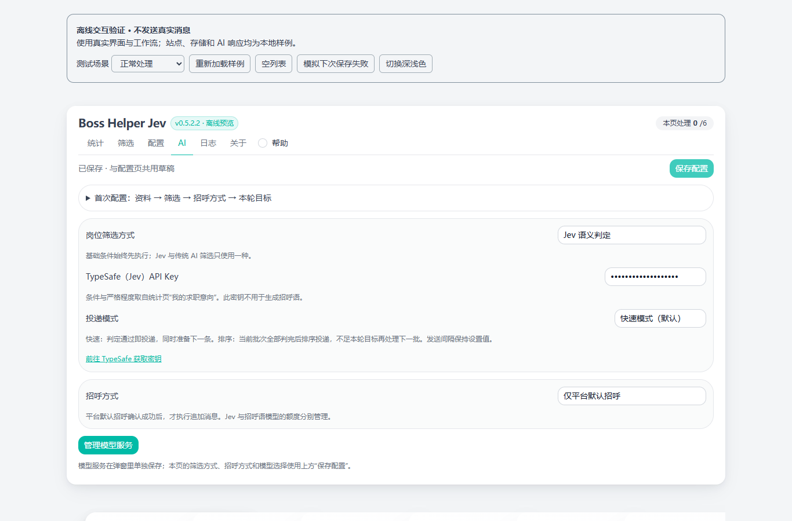

# Boss Helper Jev

用于 BOSS 直聘的岗位筛选与招呼辅助扩展。集中管理求职意向，按基础条件或 AI 判定筛选岗位，并查看每轮进度、成功记录和跳过原因。

基于 [Ocyss/boss-helper](https://github.com/Ocyss/boss-helper) 二次开发，使用 **Bun · Vue 3 · WXT**。当前版本 **0.5.2.2（未发布）**，以 Chrome 为主要验证目标。

[安装与更新](docs/installation.md) · [首次使用与 AI 配置](docs/getting-started.md) · [更新记录](CHANGELOG.md) · [全部文档](docs/README.md) · [上传说明](docs/publishing.md)



*截图来自真实 Vue 组件的离线预览，使用合成资料。更多截图见 [界面验证记录](docs/release-readiness.md#真实组件界面检查)。*

## 能做什么

- **管理求职意向**：维护目标岗位、简历、想要和避免的条件；可在本地提取带文字层的 PDF 简历。
- **按需筛选**：基础条件始终先执行，可叠加 Jev 语义判定或传统 AI 筛选。Jev 展示契合度、条件判定和过滤原因。
- **选择投递模式**：快速模式判定通过后逐条发送，同时准备下一条；排序模式先判断当前已加载批次，再按契合度投递，不足目标时继续加载。
- **控制运行范围**：本轮成功目标默认 50，与每日设置共同生效，每日最多 150。支持暂停与继续、公司 / HR 去重和跨标签页运行锁。
- **单独配置招呼**：可使用平台默认招呼、自定义消息或 AI 追加招呼。Jev 与招呼模型分别配置，支持兼容的模型服务和自定义接口地址。
- **检查结果与日志**：已确认的成功不会被后续步骤失败覆盖；发送结果未知时停止待核实。日志支持分类、搜索、分页、复制和导出。

## 安装

有 Release 时，下载附件中以 `-chrome.zip` 结尾的安装包，解压到固定目录。在 `chrome://extensions` 开启开发者模式，选择「加载已解压的扩展程序」，加载包含 `manifest.json` 的目录。

也可以从完整源码构建。需要 Git 和 Bun，已验证 Bun **1.3.12**：

```sh
bun install --frozen-lockfile
bun run build:chrome
```

构建后加载 `.output/chrome-mv3`。本发布快照已包含固定版本的日志组件源码，不需要初始化 Git 子模块。Source code ZIP 是源码，需构建后才能安装。

更新请沿用原加载目录，重新加载扩展后刷新 BOSS 标签页。完整步骤、校验方法与其他浏览器说明见 [安装与更新](docs/installation.md)。

## 第一次使用

1. 登录 BOSS 直聘并打开岗位搜索 / 推荐页，在「统计 → 我的求职意向」填写并保存资料。
2. 在 AI 页选择筛选方式和招呼方式。仅基础筛选与平台默认招呼无需 AI Key；Jev 使用 TypeSafe Key，传统 AI 筛选与招呼生成使用模型服务。
3. 检查筛选条件、消息内容与每日额度，再设置本轮目标和模式。首次建议将本轮目标设为 **1–3**，核对岗位与消息后再开始；点击开始会执行真实沟通。
4. 关注本轮进度。出现验证码、平台限制或发送结果待核实，先检查平台和聊天记录，再决定后续操作。

模型编辑需要先「应用到草稿」，再「保存模型配置」。额度与参数修正后可继续本轮，详见 [首次使用与 AI 配置](docs/getting-started.md)。

## 使用前了解

- 启用 AI 会把相关岗位、提示词和求职资料发送给配置的供应商。连接测试也可能产生费用；打开设置页不会自动测试。
- API Key 保存在本地配置中，没有应用层加密。个人备份包含敏感信息；日志脱敏不等于匿名化。详情见 [隐私与数据说明](PRIVACY.md)。
- 本轮队列和续跑状态保存在当前标签页内存，刷新后不能恢复同一轮；成功与去重记录另行持久化。每日统计仅包含本工具记录，平台限额仍优先。
- Gemini 等模型能否使用取决于供应商、接口协议和账号权限；本版不保证所有中转服务兼容。Edge / Firefox 尚需独立验收。
- 本版保留岗位 AI 筛选与招呼生成，已移除独立对话侧栏。不是 BOSS 官方产品，使用时应遵守平台规则。

## 开发与验证

```sh
bun test ./tests
bun run lint
bun run build:chrome
git diff --check
```

`bun run dev` 启动扩展开发；`bun run demo` 在 `http://127.0.0.1:5174` 展示真实组件的离线样例，不发送消息或请求收费 AI。开发约定见 [贡献指南](CONTRIBUTING.md)，日志子模块安装细节见 [补丁说明](docs/devlog-patch.md)。

2026-10-02 验证：**124 项离线测试、498 个断言通过**，Lint 与 Chrome 生产构建通过。范围与限制见 [验证记录](docs/release-20261002.md)；性能数据见 [受控性能对比](docs/performance-comparison.md)，不作为线上速度承诺。

## 反馈、来源与许可

反馈请通过 [本版 Issues](https://github.com/az1412/boss-helper-jev/issues) 提供版本、复现步骤和脱敏后的错误提示；安全问题见 [SECURITY.md](SECURITY.md)。安装包见 [本版 Releases](https://github.com/az1412/boss-helper-jev/releases)，上游的商店、反馈和更新入口不代表本版。

本项目保留上游 [MIT License](LICENSE) 与原版权。第三方组件、补丁和基准快照来源见 [THIRD_PARTY_NOTICES.md](THIRD_PARTY_NOTICES.md)。本版开发使用 AI 辅助，上游功能和第三方组件不作为独立原创。

感谢 [Ocyss/boss-helper](https://github.com/Ocyss/boss-helper)、[Oko-Tester/devlog-ui](https://github.com/Oko-Tester/devlog-ui) 及依赖维护者；沿用上游对 [boss_batch_push](https://github.com/yangfeng20/boss_batch_push)、[vite-plugin-monkey](https://github.com/lisonge/vite-plugin-monkey)、[GPT_API_free](https://github.com/chatanywhere/GPT_API_free)、[uiverse.io](https://uiverse.io/) 和 MQTT 协议参考资料的致谢。
